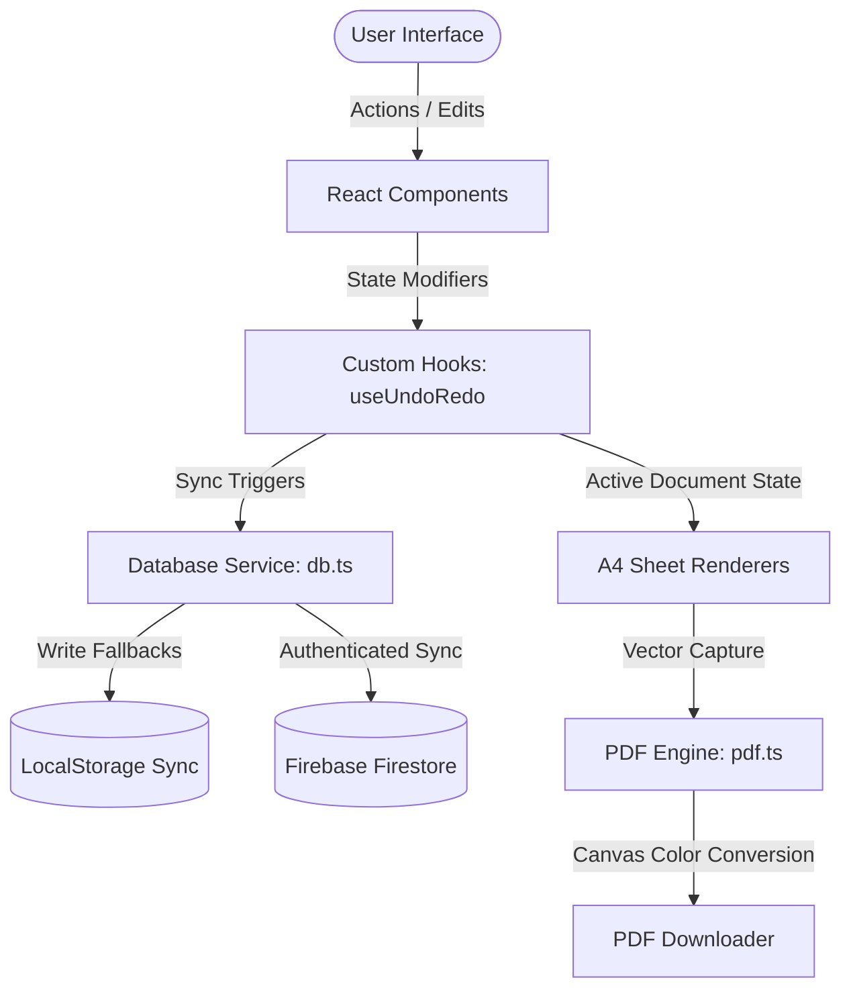

# 📖 Technical Architecture & Migration Report

This document details the architecture, design patterns, and engineering choices implemented in the **React-Tailwind CV & Cover Letter SaaS Suite** (`resume-cv-mvp`). It acts as a comprehensive documentation manual for the project's layout templates, state-management models, offline synchronization, and PDF rendering layers.

---

## 🏗️ Architectural Overview

The application has been rebuilt from the ground up as a component-driven Single Page Application (SPA) using **React**, **TypeScript**, and **Tailwind CSS**. It replaces the dual-page, script-injected, DOM-heavy architecture of the original Vanilla JS codebase with a clean, unidirectional data flow model.

### System Architecture Flow Chart

---

## 🎨 Core Design Decisions

### 1. Color Palette: Light Theme Transition
The user interface has been customized to utilize a cohesive, premium light theme. It strips away dark mode layouts in favor of clean margins, subtle shadows, and light backgrounds:
- **Sidebar**: Neutral light gray (`#f9fafb`) with fine borders for inputs.
- **Canvas Viewport**: Warm off-white background (`#f3f4f6`) to make A4 documents stand out.
- **Typography**: Uses modern font configurations (Inter / Merriweather / Courier) tailored to each template style.

### 2. State & History Manager (`useUndoRedo.ts`)
To preserve document history, the application leverages a custom hook tracking a stack of states.
- It maintains `past` (undo stack), `present` (active state), and `future` (redo stack).
- Side effects like Gemini AI changes, bullet improvements, drag-and-drop ordering, and input field blurs trigger history additions.
- Undo/redo actions are bound globally using document-level hotkeys (`Cmd+Z` / `Ctrl+Z` / `Cmd+Y` / `Ctrl+Shift+Z`).

### 3. PDF Generator and Modern CSS Patch (`pdf.ts`)
Standard vector capture tools like `html2canvas` crash when meeting modern CSS color spaces like `oklch()` and `oklab()`. To solve this:
- We built a native **OKLCH-to-RGBA converter** directly into the PDF compilation flow.
- A virtual single-pixel Canvas context is created, color styles are applied to it, and the browser resolves the raw pixel array into native `rgba()` formatting.
- Documents are captured inside viewport bounds at high DPI, stripping preview shadows and editor highlights dynamically to produce clean, edge-to-edge vector PDFs.

---

## 📁 Key File Reference & Directory Mapping

### 1. `src/components/` (Interface & Layout Controller)
- **`LandingPage.tsx`**: Features visual scroll configurations, layout galleries, and authorization portals.
- **`TemplateCarousel.tsx`**: Sidebar slider displaying actual document miniatures scaled to `11%` size via CSS scale transforms.
- **`TemplatePicker.tsx`**: Replaces standard gray boxes with mock-filled document sheets.
- **`ATSWidget.tsx`**: Compares CV text with job description keyword densities and handles inline AI suggestion chips.

### 2. `src/templates/` (Document Renderers)
- **`ResumeTemplates.tsx`**: Houses Navy, Serif, Sidebar, and Tech resume layouts.
- **`CoverLetterTemplates.tsx`**: Houses Navy, Serif, Sidebar, and Tech cover letter layouts.
- Both components support `contentEditable={true}` fields with custom `onBlur` listeners to capture modifications instantly.

### 3. `src/services/` (Backends & AI)
- **`db.ts`**: Checks user state and routes changes dynamically between Firestore collections (for authenticated users) and LocalStorage (for guest users).
- **`gemini.ts`**: Coordinates prompts, formats text variables, parses raw PDF input text, and handles bullet suggestions.
