# Architecture & Component Guide

This document describes how **resume-cv-mvp** is organized today, how data flows through the app, and the planned **modular (atomic) component structure** for future work. Use it as the onboarding guide for anyone touching UI, templates, or state.

---

## Table of contents

1. [Quick orientation](#quick-orientation)
2. [Runtime architecture](#runtime-architecture)
3. [Current folder map](#current-folder-map)
4. [Editor layout (three panels)](#editor-layout-three-panels)
5. [State & data model](#state--data-model)
6. [Dual editing surfaces](#dual-editing-surfaces)
7. [Template system](#template-system)
8. [Shared vs duplicated code](#shared-vs-duplicated-code)
9. [Target modular structure](#target-modular-structure)
10. [Migration roadmap](#migration-roadmap)
11. [Reference implementation](#reference-implementation)
12. [PDF export](#pdf-export)
13. [Contributor cookbook](#contributor-cookbook)

---

## Quick orientation

| I want to… | Start here |
|------------|------------|
| Change a form field (left panel) | `src/components/ResumeForm.tsx`, `forms/resume/*Section.tsx`, or `CoverLetterForm.tsx` |
| Change how the PDF preview looks | `src/templates/ResumeTemplates.tsx` or `CoverLetterTemplates.tsx` |
| Change fonts, colours, spacing | `src/components/DesignPanel.tsx` + `src/types/index.ts` (`LayoutSettings`) |
| Change header / photo layout | `src/templates/TemplateHeader.tsx` |
| Add a new resume template | New branch in `ResumeTemplates.tsx` (see [Template system](#template-system)) |
| Wire undo/redo or autosave | `src/hooks/useUndoRedo.ts`, `useAutoSave.ts` |
| Change AI / ATS behaviour | `src/hooks/useAiActions.ts`, `src/services/gemini.ts`, `JDPanel.tsx` |
| Change PDF export | `src/services/pdf.ts` — see [PDF export](#pdf-export); use print, not html2canvas |
| Add or change TypeScript types | `src/types/index.ts` |
| Run tests | `npm run test` (Vitest) |

**Largest files (refactor priorities):**

| File | ~Lines | Role |
|------|-------:|------|
| `templates/ResumeTemplates.tsx` | 11 | Re-export barrel → `resume/ResumeTemplateRenderer` |
| `templates/resume/` | ~1,200+ | Router + 7 variant files + setup hook |
| `templates/shared/` | ~900+ | EditableText, BulletList, ItemWrapper, icons, … |
| `templates/TemplateHeader.tsx` | 858 | Shared header (5 styles) — split pending |
| `components/DesignPanel.tsx` | 408 | Design / typography controls (AccordionSection + ToggleSwitch) |
| `App.tsx` | 364 | Auth routing, doc lifecycle, modal orchestration |
| `components/ResumeForm.tsx` | 99 | Thin orchestrator — 8 section organisms + PdfImportBlock |

---

## Runtime architecture

```mermaid
flowchart TB
  subgraph pages [Pages]
    Landing[LandingPage]
    Dash[Dashboard]
    Editor[App — Editor]
  end

  subgraph panels [Editor panels]
    Left[ResumeForm / CoverLetterForm]
    Center[ResumeTemplateRenderer / CoverLetterTemplateRenderer]
    Right[DesignPanel / JDPanel]
  end

  subgraph hooks [Hooks]
    Undo[useUndoRedo]
    Save[useAutoSave]
    AI[useAiActions]
  end

  subgraph services [Services]
    DB[db.ts]
    Gemini[gemini.ts]
    PDF[pdf.ts]
  end

  Landing --> Dash --> Editor
  Editor --> Left
  Editor --> Center
  Editor --> Right
  Left --> Undo
  Center --> Undo
  Right --> Undo
  Undo --> Save --> DB
  AI --> Gemini
  Editor --> PDF
```



**Unidirectional flow:** User edits → component callback → `useUndoRedo.set()` → React re-render → autosave → Firestore or LocalStorage.

---

## Current folder map

```
src/
├── App.tsx                 # Auth routing, editor shell, modal orchestration
├── main.tsx
├── index.css               # Tailwind v4 + theme tokens
│
├── types/
│   └── index.ts            # ResumeState, CoverLetterState, LayoutSettings, TemplateId
│
├── config/
│   ├── defaultResume.ts    # Sample resume + default layoutSettings
│   ├── defaultCL.ts        # Sample cover letter
│   ├── fonts.ts            # FONT_OPTIONS, FONT_CSS
│   └── templates.ts        # TEMPLATE_CATALOG — single source for all pickers
│
├── constants/
│   ├── animations.ts       # SECTION_ANIM, ITEM_ANIM, PAGE_ANIM, MODAL_* 
│   └── formClasses.ts      # inputCls, sectionShellCls, addButtonCls, …
│
├── hooks/
│   ├── useUndoRedo.ts      # past / present / future stacks
│   ├── useAutoSave.ts      # Debounced persist
│   ├── useResumeMutations.ts   # Shared resume add/delete/field callbacks
│   ├── useCoverLetterMutations.ts  # Cover letter field + highlight callbacks
│   ├── useAiActions.ts     # Tailor, inject keyword, improve bullet
│   ├── useKeyboardShortcuts.ts
│   ├── useOnlineStatus.ts
│   ├── useSheetOverflow.ts
│   └── useToast.ts
│
├── services/
│   ├── db.ts               # Firestore + LocalStorage hybrid
│   ├── firebase.ts
│   ├── gemini.ts           # AI prompts, PDF text parsing
│   └── pdf.ts              # Print-based PDF export (iframe + window.print)
│
├── utils/
│   ├── bullets.ts          # splitIntoBullets (shared string format)
│   ├── markdown.ts         # formatMarkdownBold (**bold** → HTML)
│   └── jdMatcher.ts        # ATS keyword scoring
│
├── components/
│   ├── ui/                     # Atoms + molecules (domain-agnostic)
│   │   ├── AccordionSection.tsx
│   │   ├── AddItemButton.tsx
│   │   ├── BulletEditor.tsx
│   │   ├── ImageUploadField.tsx
│   │   ├── ItemActionBar.tsx
│   │   ├── Modal.tsx
│   │   ├── ToggleSwitch.tsx
│   │   └── index.ts
│   ├── layout/
│   │   ├── EditorLayout.tsx    # Three-panel editor shell + lazy template renderers
│   │   ├── SettingsDropdown.tsx
│   │   └── OfflineBanner.tsx
│   ├── forms/
│   │   └── resume/
│   │       ├── ContactSection.tsx
│   │       ├── SummarySection.tsx
│   │       ├── SkillsSection.tsx
│   │       ├── ExperienceSection.tsx
│   │       ├── EducationSection.tsx
│   │       ├── CertsSection.tsx
│   │       ├── AchievementsSection.tsx
│   │       ├── LanguagesSection.tsx
│   │       └── PdfImportBlock.tsx
│   ├── ResumeForm.tsx      # Thin orchestrator (~99 lines) — wires section organisms
│   ├── CoverLetterForm.tsx # 3 sections
│   ├── DesignPanel.tsx     # 10 design accordions (uses config/templates.ts)
│   ├── EditorHeader.tsx    # Toolbar, zoom, modals triggers
│   ├── SectionHeader.tsx   # ★ only shared accordion button
│   ├── JDPanel.tsx         # Job description + ATS tab
│   ├── ATSWidget.tsx
│   ├── TemplatesModal.tsx  # Full template picker with live preview
│   ├── TemplatePicker.tsx  # Legacy carousel modal
│   ├── TemplateCarousel.tsx
│   ├── AddSectionModal.tsx # Designer template: add section
│   ├── RearrangeSectionsModal.tsx
│   ├── ConfirmModal.tsx
│   ├── RenameModal.tsx
│   ├── Dashboard.tsx
│   ├── LandingPage.tsx
│   ├── Auth.tsx
│   ├── ToastContainer.tsx
│   └── ErrorBoundary.tsx
│
├── templates/
│   ├── shared/
│   │   ├── EditableText.tsx
│   │   ├── BulletList.tsx
│   │   ├── SkillsEditor.tsx
│   │   ├── templateIcons.tsx
│   │   ├── ItemWrapper.tsx, SectionWrapper.tsx, BottomSections.tsx
│   │   └── … (ActiveSectionContext, ItemLogo, DraggableSection, etc.)
│   ├── resume/
│   │   ├── ResumeTemplateRenderer.tsx   # Router — 7 explicit variants
│   │   ├── useTemplateSetup.ts
│   │   ├── types.ts
│   │   └── variants/
│   │       ├── NavyTemplate.tsx, ExecutiveTemplate.tsx
│   │       ├── SerifTemplate.tsx, SidebarTemplate.tsx, TechTemplate.tsx
│   │       ├── AtsTemplate.tsx, DesignerTemplate.tsx
│   ├── ResumeTemplates.tsx     # Re-export barrel (11 lines)
│   ├── CoverLetterTemplates.tsx
│   └── TemplateHeader.tsx      # Uses shared EditableText (5 header styles)
│
└── tests/
    ├── templates.test.tsx
    ├── pdf.test.tsx
    ├── ats.test.tsx
    ├── dashboard.test.tsx
    ├── auth.test.tsx
    └── bullets.test.ts
```

---

## Editor layout (three panels)

When a document is open, `App.tsx` delegates to `EditorLayout` (`components/layout/EditorLayout.tsx`) for the resizable three-column editor:

```
┌─────────────────────────────────────────────────────────────────────────┐
│  EditorHeader — back, title, undo/redo, zoom, templates, PDF download   │
├──────────────┬──────────────────────────────────────┬───────────────────┤
│  LEFT        │  CENTRE                              │  RIGHT            │
│  (380px+)    │  Live A4 preview                     │  Design | ATS     │
│              │                                      │                   │
│  ResumeForm  │  ResumeTemplateRenderer              │  DesignPanel      │
│  or          │  or                                  │  or               │
│  CoverLetter │  CoverLetterTemplateRenderer         │  JDPanel          │
│  Form        │  (lazy-loaded, zoomable)             │                   │
└──────────────┴──────────────────────────────────────┴───────────────────┘
```

**EditorHeader actions (resume only):**

- **Templates** → `TemplatesModal`
- **Add section** → `AddSectionModal` (designer template column layout)
- **Rearrange** → `RearrangeSectionsModal` (drag sections between columns)

**Right panel tabs:** `Design` (layout settings) · `ATS & AI` (job description, keyword match, tailor)

---

## State & data model

### Document state

Defined in `src/types/index.ts`:

| Type | Key fields |
|------|------------|
| `ResumeState` | Contact fields, `resumeSummary`, `resumeSkills`, arrays: `resumeExperience`, `resumeEducation`, `resumeCerts`, `resumeAchievements`, `resumeLanguages`, `layoutSettings` |
| `CoverLetterState` | Contact fields, `companyName`, `jobTitle`, `salutation`, `p1`–`p4`, `highlights[]`, `layoutSettings` |
| `LayoutSettings` | `template`, colours, fonts, `headerStyle`, toggles (`showPhone`, `showPhoto`, …), alignment per section, designer columns |

Defaults live in `config/defaultResume.ts` and `config/defaultCL.ts`.

### Where state lives

```tsx
// App.tsx
const resume = useUndoRedo<ResumeState>(DEFAULT_RESUME_STATE);
const cl     = useUndoRedo<CoverLetterState>(DEFAULT_CL_STATE);

// Passed down as:
<ResumeForm state={resume.state} onChange={resume.set} />
<ResumeTemplateRenderer state={resume.state} onFieldChange={...} />
<DesignPanel layout={resume.state.layoutSettings} onChange={patch => ...} />
```

### Persistence

| Storage | Used for |
|---------|----------|
| Firestore | Authenticated users (`db.ts`) |
| LocalStorage | Guest / offline users |
| `localStorage` keys | `GEMINI_API_KEY`, `ACTIVE_DOC_ID`, `ACTIVE_DOC_TYPE`, `LAST_JD` |

### Callback pattern

Resume and cover letter mutations are centralized in hooks and spread into both editing surfaces:

```tsx
const resumeMutations = useResumeMutations(resume.set);
const clMutations     = useCoverLetterMutations(cl.set);

<EditorLayout resumeMutations={resumeMutations} clMutations={clMutations} ... />
```

`EditorLayout` passes `{...resumeMutations}` to `ResumeTemplateRenderer` and `{...clMutations}` to `CoverLetterTemplateRenderer`. The left form still uses `onChange` for bulk state updates; preview editing uses the mutation callbacks — both write through `useUndoRedo.set()`.

---

## Dual editing surfaces

The app supports **WYSIWYG editing on the A4 preview** and **structured editing in the left form**. Both write to the same `ResumeState`.

| Surface | Location | Mechanism |
|---------|----------|-----------|
| **Form** | `ResumeForm.tsx`, `forms/resume/ExperienceSection.tsx` | Controlled inputs, `BulletEditor` |
| **Preview** | `ResumeTemplates.tsx` | `contentEditable` via internal `E` component, saves on `onBlur` |

**Bullet string format:** Newline-separated text, parsed by `utils/bullets.ts` → `splitIntoBullets()`.

**Cover letter:** Same pattern — `CoverLetterForm` (textareas) vs `CoverLetterTemplates` (`CE` editable paragraphs). Placeholders like `{{company}}` are preserved until explicitly edited.

**Design choice for refactor:** Keep both surfaces but route mutations through one hook so form and preview never diverge.

---

## Template system

### Template IDs (`TemplateId`)

`navy` · `serif` · `sidebar` · `tech` · `ats` · `executive` · `designer`

### Resume layouts (`ResumeTemplates.tsx`)

| Template | Branch | Notes |
|----------|--------|-------|
| Navy Elegant | `if (template === 'navy')` | Classic single column |
| Harvard Serif | `if (template === 'serif')` | Serif typography |
| Creative Sidebar | `if (template === 'sidebar')` | Two-column with sidebar |
| Tech Monospace | `if (template === 'tech')` | Monospace / dev aesthetic |
| Clean ATS | `if (template === 'ats')` | ATS-friendly plain layout |
| Modern Designer | `if (template === 'designer')` | Drag-and-drop columns, section modals |
| Executive | **Implicit fallback** (no `if`) | Premium two-tone header — last branch before `return null` |

### Cover letter layouts (`CoverLetterTemplates.tsx`)

Explicit branches for `navy`, `serif`, `sidebar`, `tech`, `ats`; executive-style fallback for remaining IDs.

### Shared template pieces

| Piece | File | Purpose |
|-------|------|---------|
| `TemplateHeader` | `TemplateHeader.tsx` | Name, contact, photo — 5 `headerStyle` variants |
| `EditableText` (`E`) | `templates/shared/EditableText.tsx` | Editable span/paragraph in resume preview |
| `BulletList` | `templates/shared/BulletList.tsx` | Preview bullets with style from `layoutSettings.bulletStyle` |
| `SkillsEditor` | `templates/shared/SkillsEditor.tsx` | Chips vs plain text in preview |
| `templateIcons` | `templates/shared/templateIcons.tsx` | Icon pickers + render helpers for certs/achievements |
| `BottomSections` | `ResumeTemplates.tsx` | Certs, achievements, languages (still inline) |
| `ItemWrapper` | `ResumeTemplates.tsx` | Preview item toolbar (move, settings, delete) |
| `Paragraph` / `CE` | `CoverLetterTemplates.tsx` | Cover letter preview editing (not yet unified with `EditableText`) |

### Designer template sections

Section IDs used in `designerLeftSections` / `designerRightSections`:

`summary` · `skills` · `experience` · `education` · `certs` · `achievements` · `languages`

Managed via `AddSectionModal` and `RearrangeSectionsModal` in `App.tsx`.

### Template catalog

Single source of truth: **`config/templates.ts`**.

| Export | Consumers |
|--------|-----------|
| `TEMPLATE_CATALOG` | `TemplatesModal.tsx`, `TemplatePicker.tsx` |
| `TEMPLATES_FOR_DESIGN` | `DesignPanel.tsx` |
| `TEMPLATES_FOR_CAROUSEL` | `TemplateCarousel.tsx` |

Also exports `TEMPLATE_IDS`, `getTemplateById()`.

---

## Shared vs duplicated code

### Already shared (keep using these)

| Asset | Location |
|-------|----------|
| Accordion header button | `components/SectionHeader.tsx` |
| Accordion shell (molecule) | `components/ui/AccordionSection.tsx` |
| Modal shell | `components/ui/Modal.tsx` |
| Toggle switches | `components/ui/ToggleSwitch.tsx` |
| Image upload field | `components/ui/ImageUploadField.tsx` |
| Item action bar (move/delete) | `components/ui/ItemActionBar.tsx` |
| Bullet list editor | `components/ui/BulletEditor.tsx` |
| Add-item button | `components/ui/AddItemButton.tsx` |
| Editor shell | `components/layout/EditorLayout.tsx` |
| Settings dropdown | `components/layout/SettingsDropdown.tsx` |
| Offline banner | `components/layout/OfflineBanner.tsx` |
| Resume mutations hook | `hooks/useResumeMutations.ts` |
| Cover letter mutations hook | `hooks/useCoverLetterMutations.ts` |
| Template catalog | `config/templates.ts` |
| Animation tokens | `constants/animations.ts` |
| Form class tokens | `constants/formClasses.ts` |
| Markdown bold helper | `utils/markdown.ts` |
| Document types | `types/index.ts` |
| Default documents | `config/defaultResume.ts`, `defaultCL.ts` |
| Fonts | `config/fonts.ts` |
| Bullet string utils | `utils/bullets.ts` |
| Undo/redo, autosave, AI | `hooks/*` |
| Preview editable text | `templates/shared/EditableText.tsx` |
| Preview bullet list | `templates/shared/BulletList.tsx` |
| Preview skills editor | `templates/shared/SkillsEditor.tsx` |
| Template icon helpers | `templates/shared/templateIcons.tsx` |
| Preview header | `templates/TemplateHeader.tsx` |

### Recently deduplicated (Phases 0–5)

| Pattern | Status | Notes |
|---------|--------|-------|
| `TEMPLATES` array | **Done** | `config/templates.ts` — all 4 pickers import it |
| `SECTION_ANIM` / `ITEM_ANIM` | **Done** | `constants/animations.ts` — ResumeForm, DesignPanel, App, AccordionSection |
| `inputCls` and related tokens | **Done** | `constants/formClasses.ts` — all resume sections + CoverLetterForm |
| `formatMarkdownBold` | **Done** | `utils/markdown.ts` — ResumeTemplates, CoverLetterTemplates |
| `BulletEditor` | **Done** | `ui/BulletEditor.tsx` — ExperienceSection, EducationSection, CertsSection |
| `AddItemButton` | **Done** | `ui/AddItemButton.tsx` — all list sections |
| `AccordionSection` | **Done** | All 8 resume sections, CoverLetterForm (3 sections), DesignPanel (10 accordions) |
| `Modal` shell | **Done** | Confirm, Rename, Templates, AddSection, Rearrange |
| `ToggleSwitch` | **Done** | DesignPanel header visibility + photo toggles |
| `ImageUploadField` | **Done** | ContactSection, ExperienceSection, EducationSection |
| `ItemActionBar` | **Done** | ExperienceSection, EducationSection, CertsSection |
| `useResumeMutations` | **Done** | Wired via `EditorLayout` → preview renderer |
| `useCoverLetterMutations` | **Done** | Wired via `EditorLayout` → cover letter preview |
| `EditorLayout` + layout helpers | **Done** | `App.tsx` 641→364 lines |
| Preview shared blocks | **Partial** | `EditableText`, `BulletList`, `SkillsEditor`, `templateIcons` extracted; `BottomSections` / `ItemWrapper` still in `ResumeTemplates.tsx` |
| `EditableText` (cover letter) | **Partial** | Resume uses `templates/shared/EditableText`; CL still has local `CE` + `Paragraph` |

### Still duplicated (remaining refactor targets)

| Pattern | Copies | Files |
|---------|--------|-------|
| Image / logo upload UI | 1×+ | `TemplateHeader.tsx` (inline upload — not yet on `ImageUploadField`) |
| Editable text (`CE`, `Paragraph`) | 1× | `CoverLetterTemplates.tsx` (resume unified via `EditableText`) |
| Resume template variants | 7× `templates/resume/variants/*.tsx` | ✅ Done |
| Cover letter templates | 1× `CoverLetterTemplates.tsx` | Split optional |
| TemplateHeader variants | 1× file, 5 styles inline | Split optional |
| `TemplateHeader` variants | 1× | `TemplateHeader.tsx` (858 lines — split pending) |
| `Button`, `Input`, `Label` atoms | — | Not extracted; forms use raw `<input>` + `formClasses.ts` tokens |
| `useArrayFieldUpdater` hook | — | Not implemented (mutations inlined in `useResumeMutations`) |

---

## Target modular structure

We follow **atomic design** layers. Names map to folders under `src/components/`.

```
Atomic design          Folder                      Example
─────────────────────────────────────────────────────────────────
Atoms                  components/ui/              Button, Input, Label, ToggleSwitch
Molecules              components/ui/              AccordionSection, Modal, BulletEditor
Organisms              components/forms/           ExperienceSection, DesignPanel sections
Templates (pages)      App.tsx, layout/          Editor shell, Dashboard
```

### Target tree (end state)

```
src/
├── components/
│   ├── ui/                     # Atoms + molecules (no ResumeState imports)
│   │   ├── Button.tsx
│   │   ├── Input.tsx
│   │   ├── AccordionSection.tsx
│   │   ├── Modal.tsx
│   │   ├── BulletEditor.tsx
│   │   ├── ImageUploadField.tsx
│   │   ├── ItemActionBar.tsx
│   │   └── ToggleSwitch.tsx
│   │
│   ├── forms/
│   │   ├── resume/
│   │   │   ├── ResumeForm.tsx           # ~80 lines — orchestrator only
│   │   │   ├── ContactSection.tsx
│   │   │   ├── ExperienceSection.tsx
│   │   │   └── ...
│   │   └── coverletter/
│   │
│   ├── modals/                 # Thin wrappers over ui/Modal (optional future)
│   └── layout/
│       ├── EditorLayout.tsx    # ✅ exists
│       ├── EditorHeader.tsx    # still in components/ today
│       ├── SettingsDropdown.tsx
│       └── OfflineBanner.tsx
│
├── templates/
│   ├── shared/                 # ✅ partial — EditableText, BulletList, SkillsEditor, templateIcons
│   │   ├── BulletList.tsx
│   │   ├── SkillsEditor.tsx
│   │   └── EditableText.tsx
│   ├── resume/                 # ⏳ not yet — variants still in ResumeTemplates.tsx
│   │   ├── ResumeTemplateRenderer.tsx
│   │   └── variants/
│   │       ├── NavyTemplate.tsx
│   │       ├── DesignerTemplate.tsx
│   │       └── ExecutiveTemplate.tsx
│   └── TemplateHeader/         # ⏳ not yet — single TemplateHeader.tsx today
│
├── config/
│   └── templates.ts            # Single TEMPLATES catalog
│
├── constants/
│   ├── animations.ts
│   └── formClasses.ts
│
└── hooks/
    ├── useResumeMutations.ts       # ✅ exists
    ├── useCoverLetterMutations.ts  # ✅ exists
    └── useArrayFieldUpdater.ts     # ⏳ not yet
```

### Layer rules

1. **Atoms** — No domain types. Variants via props (`variant="primary"`).
2. **Molecules** — Compose atoms; still reusable outside resume domain where possible.
3. **Organisms** — Know about `ResumeState` / `CoverLetterState`; receive `{ state, onChange }` or `{ mutations }`.
4. **Templates (`templates/`)** — Presentational renderers + preview edit callbacks; no Firebase/Gemini.
5. **One component per file** for organisms; barrel `index.ts` optional.

### Form ↔ preview sync (implemented)

Shared mutations are wired through `EditorLayout`:

```tsx
const resumeMutations = useResumeMutations(resume.set);
const clMutations     = useCoverLetterMutations(cl.set);

<EditorLayout resumeMutations={resumeMutations} clMutations={clMutations} ... />
```

Preview renderers receive `{...resumeMutations}` / `{...clMutations}`. The left form uses `onChange` for structured edits; both paths write through `useUndoRedo.set()`.

---

## Migration roadmap

Work in small PRs. Old and new patterns can coexist during migration.

### Phase 0 — Foundation (low risk) ✅

- [x] `config/templates.ts` — dedupe 4 catalog copies
- [x] `constants/animations.ts` — `SECTION_ANIM`, `ITEM_ANIM`, `MODAL_*`, `PAGE_ANIM`
- [x] `constants/formClasses.ts` — `inputCls`, `labelCls`, `sectionShellCls`, …
- [x] `utils/markdown.ts` — single `formatMarkdownBold`

### Phase 1 — Atoms & molecules ✅ (core complete)

- [x] `AccordionSection` → all 8 resume sections, CoverLetterForm, DesignPanel
- [x] `Modal` shell → all 5 modals migrated
- [x] `AddItemButton`, `BulletEditor`, `ToggleSwitch`, `ImageUploadField`, `ItemActionBar`
- [ ] `Button`, `Input`, `Label` — optional; forms currently use `formClasses.ts` tokens on native elements

### Phase 2 — Form organisms ✅

- [x] Split `ResumeForm.tsx` — 8 section organisms + PdfImportBlock; orchestrator ~99 lines (was 759)
- [x] `ImageUploadField`, `ItemActionBar` — deduped in Contact, Experience, Education, Certs sections
- [ ] `useArrayFieldUpdater` hook — deferred; logic lives in `useResumeMutations`

### Phase 3 — App cleanup ✅ (core complete)

- [x] `useResumeMutations` + `useCoverLetterMutations` — wired via `EditorLayout`
- [x] `SettingsDropdown`, `OfflineBanner`, `EditorLayout` → `components/layout/`
- [~] `App.tsx` 641→364 lines (target ~200 not yet reached — auth, routing, modals still inline)

### Phase 4 — Template layer ✅ (core complete)

- [x] Extract shared blocks → `templates/shared/*`
- [x] One file per variant under `templates/resume/variants/` (7 templates)
- [x] Explicit `ExecutiveTemplate.tsx` + router in `ResumeTemplateRenderer.tsx`
- [ ] Split `TemplateHeader` variants (optional)
- [ ] Split `CoverLetterTemplates.tsx` (optional)

### Phase 5 — Polish ✅ (core complete)

- [x] Unify `EditableText` — resume, cover letter, and TemplateHeader
- [~] Skills editor — preview uses `SkillsEditor`; form still comma-separated textarea
- [ ] Optional Storybook or `/dev/ui` playground

### Priority matrix

| Priority | Task | Impact | Effort | Status |
|----------|------|--------|--------|--------|
| **P0** | `templates.ts` + form classes + animations | High | Low | ✅ Done |
| **P0** | `AccordionSection` everywhere | High | Low–Med | ✅ Done |
| **P0** | `Modal` shell | High | Low | ✅ Done |
| **P1** | Split `ResumeForm` | High | Medium | ✅ Done (~99 lines) |
| **P1** | `ToggleSwitch`, `ImageUploadField`, `ItemActionBar` | Medium | Low | ✅ Done |
| **P2** | `useResumeMutations` + `EditorLayout` | Sync + slimmer App | Medium | ✅ Done (App 364 lines) |
| **P2** | `useCoverLetterMutations` | CL preview sync | Low | ✅ Done |
| **P3** | Template shared blocks + variant split | Maintainability | High | ✅ Done |
| **P4** | `TemplateHeader` / CL split, Storybook | Polish | Low–Med | ⏳ Optional |

**Optional follow-ups:** Split `TemplateHeader` by `headerStyle`; split `CoverLetterTemplates` variants; extract `Button`/`Input`/`Label` atoms; Storybook playground; slim `App.tsx` further (~250 lines).

---

## Reference implementation

**`src/components/forms/resume/*Section.tsx`** organisms are the canonical pattern for resume form sections. All 8 sections are extracted.

| Section organism | File | Notes |
|------------------|------|-------|
| Contact Details | `ContactSection.tsx` | Avatar upload |
| Profile Summary | `SummarySection.tsx` | Textarea |
| Skills | `SkillsSection.tsx` | Comma-separated textarea |
| Work History | `ExperienceSection.tsx` | AI improve-bullet, `BulletEditor` |
| Education | `EducationSection.tsx` | `BulletEditor`, logo settings |
| Certifications | `CertsSection.tsx` | Icon picker, `BulletEditor` |
| Achievements | `AchievementsSection.tsx` | Icon picker |
| Languages | `LanguagesSection.tsx` | Name + level inputs |
| PDF import | `PdfImportBlock.tsx` | Gemini PDF parsing |

| Concern | Implementation |
|---------|----------------|
| Accordion shell | `<AccordionSection>` from `ui/AccordionSection.tsx` |
| Section animations | `ITEM_ANIM` from `constants/animations.ts` |
| Input / card styling | `inputCls`, `itemCardCls`, … from `constants/formClasses.ts` |
| Bullet editing | `<BulletEditor>` from `ui/BulletEditor.tsx` |
| Add row | `<AddItemButton>` from `ui/AddItemButton.tsx` |
| Avatar / logo upload | `<ImageUploadField>` from `ui/ImageUploadField.tsx` |
| Item move / delete | `<ItemActionBar>` from `ui/ItemActionBar.tsx` |
| Props contract | `{ state, onChange, openSection, onToggle }` + section-specific callbacks (e.g. `onImproveBullet`) |
| Wiring | Imported and rendered by `ResumeForm.tsx` — orchestrator keeps accordion state and passes handlers down |

```tsx
// ResumeForm.tsx — thin orchestrator (~99 lines)
<PdfImportBlock onChange={onChange} geminiKey={geminiKey} />
<ContactSection state={state} onChange={onChange} openSection={openSection} onToggle={toggle} />
<SummarySection ... />
<SkillsSection ... />
<ExperienceSection ... onImproveBullet={onImproveBullet} aiLoading={aiLoading} isOnline={isOnline} />
<EducationSection ... />
<CertsSection ... />
<AchievementsSection ... />
<LanguagesSection ... />
```

Cover letter sections use the same `<AccordionSection>` pattern in `CoverLetterForm.tsx` (3 sections). Resume preview editing uses `templates/shared/EditableText`; cover letter preview still uses local `CE` / `Paragraph` components.

---

## PDF export

### Decision: use browser print, not html2canvas

| Approach | Used by | Result |
|----------|---------|--------|
| **`window.print()` + `@media print`** | Resume.io, Zety, Novoresume, CVFREE, this app | Pixel-perfect match to preview |
| **html2canvas + jsPDF** | Older tutorials, our deprecated `downloadPdfLegacy()` | Broken flex, icons, chips, oklch colors |

**Do not re-enable html2pdf/html2canvas for the Download PDF button.** We tried extensive oklch sanitization and layout inlining; layout still diverged from the preview.

### How download works today

Entry point: `EditorRoute.tsx` → `PdfService.downloadPdf(sheetRef.current, filename)` in `src/services/pdf.ts`.

```
User clicks "Download PDF"
        │
        ▼
Clone .pdf-sheet from live preview
  • strip .edit-only, [data-pdf-hide]
  • remove contenteditable
  • resolve img src to absolute URLs
        │
        ▼
Build hidden iframe document
  • copy all document.styleSheets CSS
  • copy Google Fonts <link> tags
  • inject @page { size: A4; margin: 0 }
  • inject print-color-adjust: exact
        │
        ▼
iframe.contentWindow.print()
        │
        ▼
User selects "Save as PDF" in browser dialog
```

The suggested filename (`Name_Resume.pdf`) is not auto-applied — the browser print dialog controls the save path. Toast copy in `EditorRoute` tells the user to pick **Save as PDF**.

### Files to touch when changing export

| File | Role |
|------|------|
| `src/services/pdf.ts` | `downloadPdf()` — iframe build + print trigger |
| `src/index.css` | `@media print` — hide editor chrome, A4 sizing, color-adjust |
| `src/pages/EditorRoute.tsx` | Download button handler + toast messages |
| `src/tests/pdf.test.tsx` | Tests iframe write + print (not html2pdf) |

### Legacy code (reference only)

- `PdfService.downloadPdfLegacy()` — old html2pdf.js pipeline; **not used by UI**
- `sanitizeCssOklch()` — still exported/tested; was for html2canvas; keep if legacy path stays

### If export looks wrong

1. Fix **`@media print` in `index.css`** first — print uses real CSS, not canvas hacks
2. Ensure editor-only UI has class **`edit-only`** or **`data-pdf-hide`** so it is stripped from the clone
3. Do **not** add html2canvas workarounds unless product explicitly requires silent one-click download without a print dialog (that would need a server-side Puppeteer/Playwright API instead)

---

## Contributor cookbook

### Add a field to the resume

1. Add property to `ExperienceItem` (or relevant type) in `types/index.ts`
2. Add default in `config/defaultResume.ts` if needed
3. Add form control in `ResumeForm.tsx` or the relevant `forms/resume/*Section.tsx` (see [Reference implementation](#reference-implementation))
4. Render in each template branch in `ResumeTemplates.tsx` (or future section block)
5. Extend `templates.test.tsx` if preview editing is involved

### Add a layout setting

1. Add optional field to `LayoutSettings` in `types/index.ts`
2. Add default in `defaultResume.ts` / `defaultCL.ts`
3. Add control in `DesignPanel.tsx`
4. Read `layoutSettings.myFlag` in template renderers

### Add a new template

1. Add id to `TemplateId` in `types/index.ts`
2. Add entry to `config/templates.ts` (`TEMPLATE_CATALOG`)
3. Add `if (template === 'mytemplate') { ... }` branch in `ResumeTemplates.tsx`
4. Add cover letter branch in `CoverLetterTemplates.tsx` if applicable
5. Add to `ALL_TEMPLATES` in `tests/templates.test.tsx`

### Accordion section pattern

All form sections (resume, cover letter, design panel) use `<AccordionSection>` — see [Reference implementation](#reference-implementation).

Legacy inline shell (do not use for new work):

```tsx
<div className="border border-border-color/50 rounded-xl overflow-hidden bg-card/10">
  <SectionHeader id="experience" icon={Briefcase} label="Work History"
    badge={count} openSection={openSection} onToggle={toggle} />
  <AnimatePresence initial={false}>
    {openSection === 'experience' && (
      <motion.div {...SECTION_ANIM} style={{ overflow: 'hidden' }}>
        <div className="p-4 border-t border-border-color/40">
          {/* section content */}
        </div>
      </motion.div>
    )}
  </AnimatePresence>
</div>
```

Import `SECTION_ANIM` from `constants/animations.ts` only if maintaining legacy code paths.

### Running the project

```bash
npm install
npm run dev      # http://localhost:5173
npm run test     # Vitest
npm run build    # tsc + vite build
npm run lint     # ESLint
```

---

## Related docs

| File | Contents |
|------|----------|
| [README.md](../README.md) | Features, install, high-level overview |
| [MIGRATION_DETAILS.md](../MIGRATION_DETAILS.md) | Vanilla JS → React migration notes |
| [Issues.md](../Issues.md) | Known template/header wiring issues |

---

*Last updated: Phases 1–5 core complete — ui atoms (ToggleSwitch, ImageUploadField, ItemActionBar), layout/ (EditorLayout, SettingsDropdown, OfflineBanner), mutation hooks, templates/shared/*, App 364 lines, DesignPanel 408 lines. Remaining: variant split, TemplateHeader split, CL EditableText, Storybook.*
